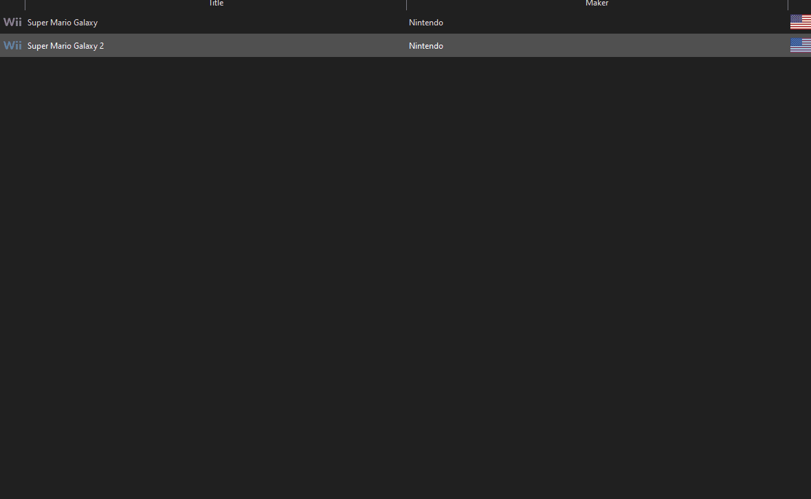
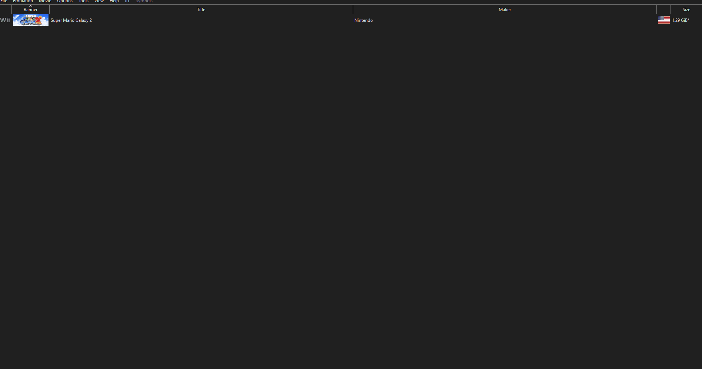

# Optimizing Load Times with UseResource
Every Super Mario Galaxy 2 level uses a file that can drastically impact level loading times. It is called UseResource, and is located in `StageData/[InternalName]/[InternalName]UseResource.arc`. It tells the game to pre-load specific files.
> It is recommended to wait until you are completely done making your levels to generate UseResources for them.
# Tools Needed*
* [smguseres](https://github.com/SunakazeKun/smguseres)
> *Dolphin is also required.
# Using smguseres
1. Download the source code.
Click the green code button and click Download ZIP. Then extract it.
2. Open the XML that corresponds to your region (likely `smg2_useres_helper_EJP.xml`) in Dolphin.

Do this by right clicking on Super Mario Galaxy 2 in Dolphin and clicking "Start with Riivolution Patches..."

Then enable it and start.



3. In dolphin, click `View -> Show Log` and `View -> Show Log Configuration`. 
4. In the Log Configuration tab, enable *only* the OSReport types.

## Logging a scenario
Create a new folder named `UseResourceLogs` in your mod's `DATA/files` folder.
1. Go to the world map.
2. Clear the log.
3. Click "Go to galaxy"
4. Go to Scenario 1.
5. Copy everything in the log into a new txt file in `UseResourceLogs` and save.

Name the txt file like this: `[InternalName]_Scenario[X].txt`

For instance: `RedBlueExGalaxy_Scenario1.txt` or `IslandFleetGalaxy_Scenario2.txt`

Now repeat this for every scenario, excluding Hidden Stars and Green Stars.

Then repeat that for each galaxy you want to generate UseResources for.

## Editing the script
Aurum, the creator of the tool, provided a sample script that you can modify.

If the mod is still open in Dolphin, don't forget to close it first.

Open `useresgen.py` in a text editor, preferrably [Visual Studio Code](https://code.visualstudio.com/Download).

```py
game_path = "D:/Modding/Super Mario Galaxy/SMG2/files"
builders = [
    # Takes three arguments. Game files path, Galaxy name and number of scenarios.
    # Number of scenarios does not include Green Stars and Hidden Stars.
    UseResourceGenerator(game_path, "IslandFleetGalaxy", 3),
    UseResourceGenerator(game_path, "YosshiHomeGalaxy", 3),
    UseResourceGenerator(game_path, "DigMineGalaxy", 3),
    UseResourceGenerator(game_path, "MokumokuValleyGalaxy", 2),
    UseResourceGenerator(game_path, "AbekobeGalaxy", 2),
    UseResourceGenerator(game_path, "RedBlueExGalaxy", 2)
]
```

This is what the default file looks like. Modify `game_path` to be the path to your mod's files, like so:

`game_path = "C:/Users/Rosalina/Super Mario Galaxy 3/data/files"`

Modify the `builders` list to have your galaxies, following the same format.

Another example:
```py
builders = [
    # Takes three arguments. Game files path, Galaxy name and number of scenarios.
    # Number of scenarios does not include Green Stars and Hidden Stars.
    UseResourceGenerator(game_path, "FlipSwapEditGalaxy", 2),
    UseResourceGenerator(game_path, "LumasWorkshopGalaxy", 3),
    UseResourceGenerator(game_path, "BigTree4Galaxy", 3)
]
```

Don't forget to save!

# Generating

Now we're going to generate the files. In the smguseres folder, open a command prompt and type:

`python useresgen.py clear`

and then:

`python useresgen.py generate`

Or you can put [this file](UseResource-Generate.bat) in the folder and run the `.bat` file.

# End
You should now have successfully generated the UseResource. The stage will load much faster now!

*Written by AwesomeTMC*
